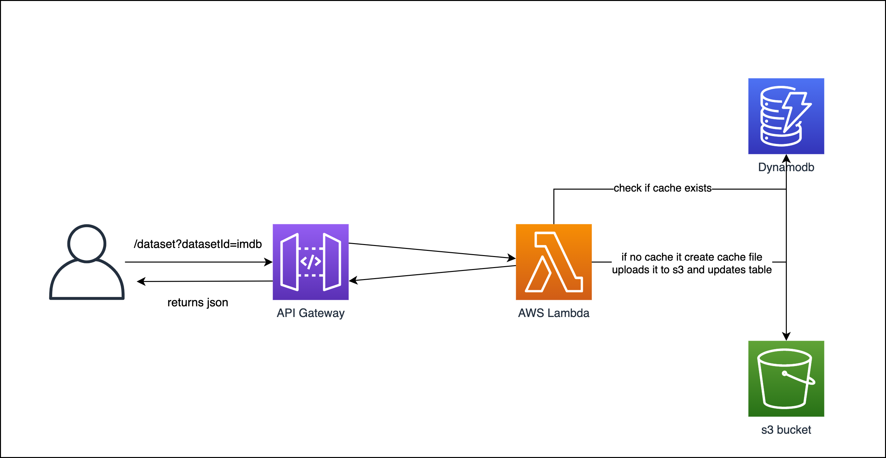

# AWS Lambda Python S3 Dynamodb DB Cache




function code is in [handler.py](./handler.py)

## Getting started

1. install `Serverless Framework`
```Bash
yarn global add serverless  
```

2. install `plugins`
```bash
yarn 
```

3. Deploy function and resources

- `aws-profile` are you local set up profile, [documentation here](https://www.serverless.com/framework/docs/providers/aws/guide/credentials/) 
- `stage` the stage of your env, default `dev`

```bash
sls deploy --aws-profile {profile} --stage {stage}
```

After deployment you should see something like this
```Bash
Service Information
service: aws-lambda-python-s3-dynamodb-cache
stage: test
region: us-east-1
stack: aws-lambda-python-s3-dynamodb-cache-test
resources: 13
api keys:
  None
endpoints:
  GET - https://x728njqepg.execute-api.us-east-1.amazonaws.com/dataset
functions:
  get_cache_file: aws-lambda-python-s3-dynamodb-cache-test-get_cache_file
layers:
  None
```
You can use the `endpoints` url to query you cache file

4. Delete endpoint

```bash
sls remove --aws-profile {profile} --stage {stage}
```

## Local development

### Testing

Install development dependencies (test/quality)

```bash
pip install -r dev.requirements.txt
```

Install production dependencies

```bash
pip install -r prod.requirements.txt
```

There is one example test for the main handler function in `tests/test_handler.py`. You can modify it. Be aware that you need to change the `environment` variables in it to match the ones from the `serverless.yaml`. 

Run tests:

```bash
make test
```

### Imitating the API Offline

You can also imitate the API offline using `serverless-offline`. The plugin will be installed when running `yarn`. For `serverless-offline` to work the S3 Bucket and the DynamoDB table need to exist.
Start your API locally.
```bash
sls offline start
```
You should now see your endpoints
```Bash
offline: Starting Offline: dev/us-east-1.
offline: Offline [http for lambda] listening on http://localhost:3002
offline: Function names exposed for local invocation by aws-sdk:
           * hello: aws-lambda-python-s3-dynamodb-cache-dev-hello

   ┌─────────────────────────────────────────────────────────────────────────┐
   │                                                                         │
   │   GET | http://localhost:3000/dataset                                   │
   │   POST | http://localhost:3000/2015-03-31/functions/hello/invocations   │
   │                                                                         │
   └─────────────────────────────────────────────────────────────────────────┘

offline: [HTTP] server ready: http://localhost:3000 🚀
```

## Resources

* [Serverless Framework Documentation](https://www.serverless.com/framework/docs/)
* [Setting Up Serverless Framework for AWS Lambda](https://www.serverless.com/framework/docs/providers/aws/guide/)
* [Serverless Python Requirements](https://www.serverless.com/plugins/serverless-python-requirements)
* [Serverless Offilne](https://github.com/dherault/serverless-offline)